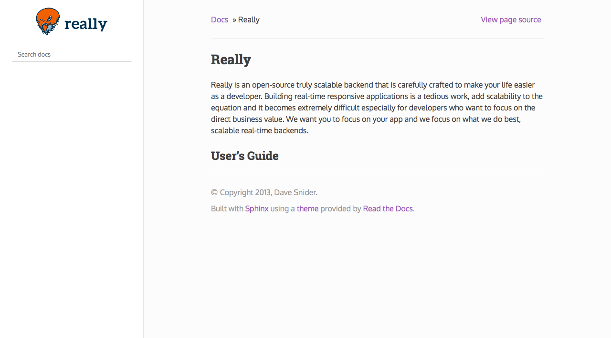

.. _bower: http://www.bower.io
.. _compass: http://www.compass-style.org
.. _sass: http://www.sass-lang.com
.. _grunt: http://www.gruntjs.com
.. _node: http://www.nodejs.com
.. _sphinx_rtd_theme: https://github.com/snide/sphinx_rtd_theme

*****************
Really Docs Theme
*****************

This theme is based on the sphinx_rtd_theme_, customized to match the Really design.

**This repo exists as a subtree within the Really code itself**, so please every change to the theme should be in this repo.

Modifying the theme
===================

The sphinx_rtd_theme is primarily a sass_ project that requires a few other sass libraries. bower_ is used to manage these dependencies and sass_ to build the css. We use grunt_ as a task runner to watch for changes, rebuild the sphinx demo docs and build a distributable version of the theme.

Set up your environment
-----------------------

1. Install sass

.. code:: bash

    gem install sass

3. Install node, bower and grunt.

.. code:: bash

    // Install node
    brew install node

    // Install bower and grunt
    npm install -g bower grunt-cli

    // Now that everything is installed, let's install the theme dependecies.
    npm install

Now that our environment is set up, go to this repository in your terminal and run grunt:

.. code:: bash

    grunt

This default task will do the following **very cool things that make it worth the trouble**.

1. It'll install and update any bower dependencies.
2. It'll run sphinx and build new docs.
3. It'll watch for changes to the sass files and build css from the changes.
4. It'll rebuild the sphinx docs anytime it notices a change to .rst, .html, .js
   or .css files.

Integration with Really
=======================

The theme is a stand alone repo and added to Really as a subtree

to make it easy to work with the repo URL you can add it as a remote

.. code:: bash

   git remote add really-docs-theme https://github.com/reallylabs/really-docs-theme

This command will add it to the repo as subtree, actually you don't need to run this command as it's already added to the Really.

.. code:: bash

  git subtree add --prefix=really-docs/src/sphinx/_themes/sphinx_rtd_theme --squash really-docs-theme master

Every time a change happened to this repo, you should do subtree pull from the Really code root as:

.. code:: bash

   git subtree pull --prefix=really-docs/src/sphinx/_themes/sphinx_rtd_theme really-docs-theme master

The conf.py file is configured to work with the theme as:

.. code:: python

    html_theme = "sphinx_rtd_theme"
    html_theme_path = ["_themes/sphinx_rtd_theme"]